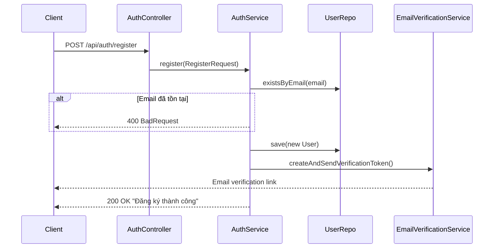
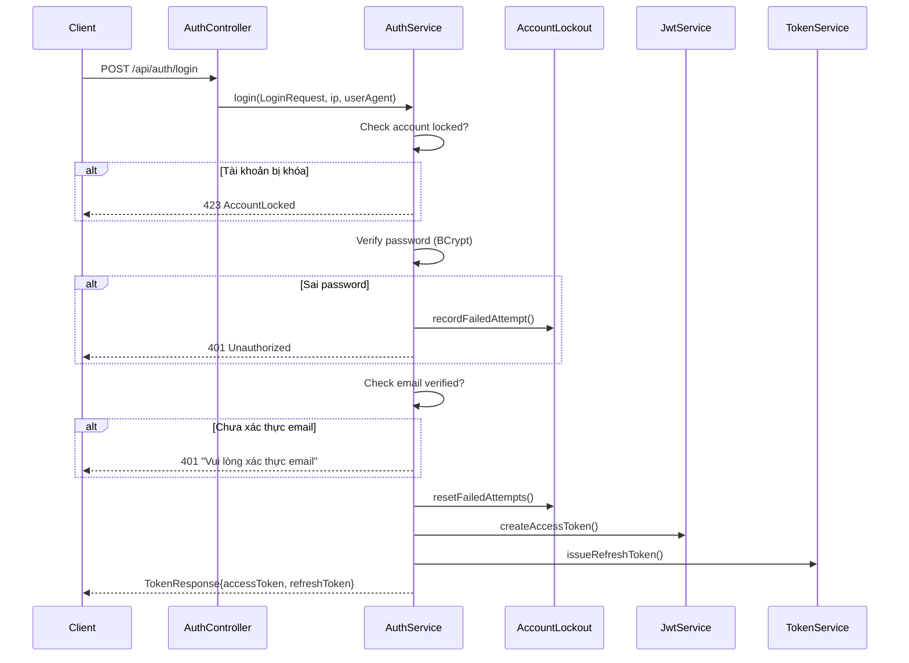
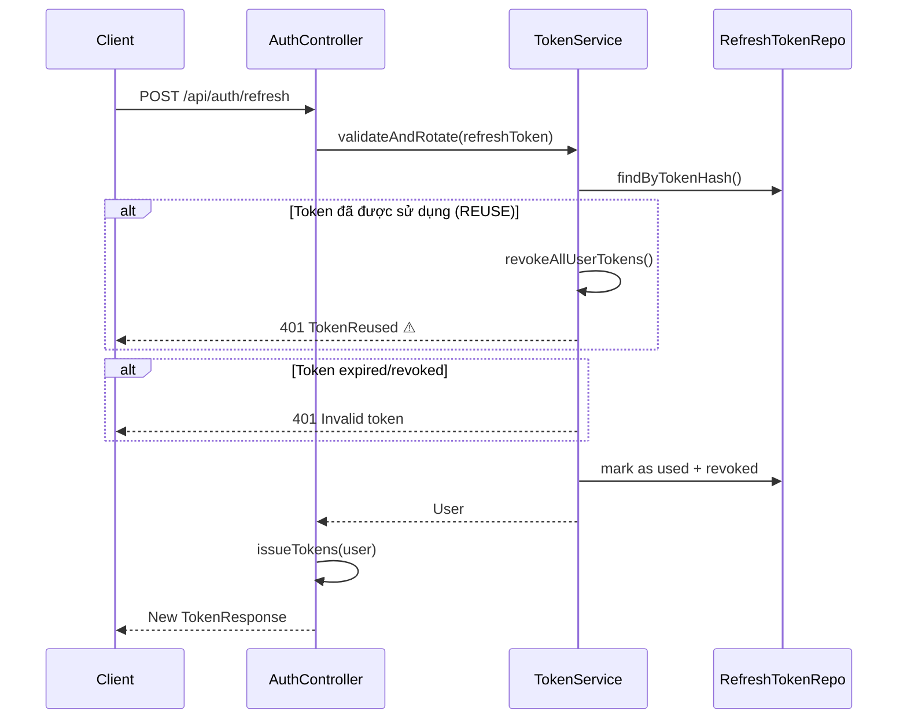
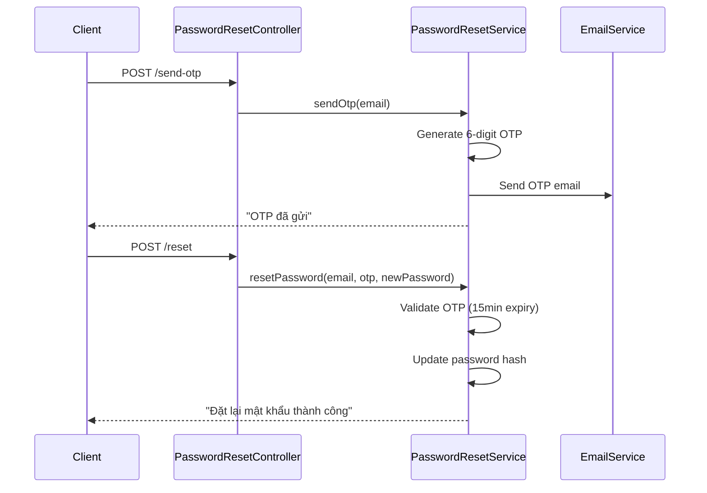

# 🔐 Authentication Module - Code Review

> **Dự án:** Pháp Luật Số - Legal AI Platform  
> **Module:** Authentication & Security  
> **Ngày review:** 13/01/2026

---

## 📁 Cấu trúc Module

```
src/main/java/com/htai/exe201phapluatso/auth/
├── controller/
│   ├── AuthController.java          # Login, Register, Refresh, Logout
│   └── PasswordResetController.java # Quên mật khẩu
├── service/
│   ├── AuthService.java             # Core authentication logic
│   ├── JwtService.java              # JWT token creation & parsing
│   ├── TokenService.java            # Refresh token management
│   ├── EmailVerificationService.java
│   ├── PasswordResetService.java
│   ├── AccountLockoutService.java   # Brute force protection
│   └── SecurityAuditService.java    # Security event logging
├── security/
│   ├── SecurityConfig.java          # Spring Security configuration
│   ├── JwtAuthFilter.java           # JWT authentication filter
│   └── AuthUserPrincipal.java       # User principal record
├── oauth2/
│   ├── CustomOAuth2UserService.java
│   ├── OAuth2AuthenticationSuccessHandler.java
│   └── OAuth2AuthenticationFailureHandler.java
├── dto/
│   ├── LoginRequest.java
│   ├── RegisterRequest.java
│   ├── TokenResponse.java
│   └── ...
├── entity/
│   ├── User.java
│   ├── RefreshToken.java
│   ├── EmailVerificationToken.java
│   ├── PasswordResetOtp.java
│   └── SecurityAuditLog.java
└── validation/
    ├── ValidPassword.java           # Custom annotation
    └── PasswordPolicyValidator.java
```

---

## 🔄 Logic Flow

### 1. Đăng ký (Register)



**Logic:**
1. Normalize email (lowercase, trim)
2. Check email chưa tồn tại
3. Hash password với BCrypt
4. Assign role "USER" mặc định
5. Set `emailVerified = false`, `enabled = true`
6. Gửi email verification token (24h expiry)

---

### 2. Đăng nhập (Login)



**Logic:**
1. Validate email/password
2. Check account lockout status
3. Verify BCrypt password
4. Check email đã xác thực (chỉ LOCAL provider)
5. Reset failed attempts khi login thành công
6. Issue Access Token + Refresh Token
7. Log security audit event

---

### 3. Token Refresh (với Rotation)



**Logic: Token Rotation với Reuse Detection**
- Mỗi refresh token chỉ dùng 1 lần
- Khi refresh: mark token cũ là `usedAt + revokedAt`, issue token mới
- Nếu token đã `usedAt != null` → **SECURITY BREACH** → revoke ALL tokens của user

---

### 4. Quên mật khẩu (Password Reset)



**Logic:**
1. **Send OTP**: Sinh OTP 6 số bằng `SecureRandom`, lưu DB (15 phút)
2. **Reset Password**: Validate OTP, update password hash

---

### 5. OAuth2 (Google Login)

**Flow:**
1. Client redirect đến `/oauth2/authorization/google`
2. Google authenticate → callback về app
3. `CustomOAuth2UserService.loadUser()` xử lý:
   - Nếu email chưa tồn tại → tạo user mới
   - Nếu email đã tồn tại với provider khác → throw error
   - Nếu cùng provider → update thông tin
4. `OAuth2AuthenticationSuccessHandler` issue tokens
5. Redirect về frontend với tokens trong URL params

---

## ✅ Điểm mạnh (Strengths)

### 1. **Token Rotation với Reuse Detection** ⭐⭐⭐
```java
// TokenService.java
if (token.getUsedAt() != null) {
    log.warn("TOKEN REUSE DETECTED for user {} - revoking all tokens", token.getUser().getId());
    revokeAllUserTokens(token.getUser().getId());
    throw new TokenReusedException(token.getUser().getId(), hash);
}
```
- **Best practice** security: phát hiện refresh token bị đánh cắp
- Tự động revoke tất cả tokens khi phát hiện reuse

### 2. **Account Lockout Protection** ⭐⭐⭐
```java
// AccountLockoutService.java
@Value("${app.security.lockout.max-attempts:5}")
private int maxAttempts;

@Value("${app.security.lockout.duration-minutes:15}")
private int lockoutDurationMinutes;
```
- Chống brute force attack
- Configurable qua properties
- Auto-unlock sau thời gian lockout

### 3. **Security Audit Logging** ⭐⭐⭐
```java
// SecurityAuditService.java - @Async logging
- LOGIN_SUCCESS, LOGIN_FAILED
- ACCOUNT_LOCKED
- TOKEN_ROTATION, TOKEN_REUSE
- RATE_LIMIT_EXCEEDED
- PASSWORD_CHANGED, PASSWORD_RESET
```
- Ghi log đầy đủ các sự kiện bảo mật
- Async để không block request
- Lưu DB để audit sau

### 4. **Password Policy Validator** ⭐⭐
```java
// PasswordPolicyValidator.java
- MIN_LENGTH = 8
- Uppercase (A-Z)
- Lowercase (a-z)  
- Digit (0-9)
- Special char (!@#$%^&*)
```
- Password strength enforcement
- Detailed error messages bằng tiếng Việt

### 5. **Email Verification** ⭐⭐
- Bắt buộc verify email trước khi login (LOCAL provider)
- Token 24h expiry
- Scheduled cleanup expired tokens

### 6. **JWT Stateless Authentication** ⭐⭐
- CSRF disabled hợp lý với stateless REST API
- SessionCreationPolicy.STATELESS
- Roles trong JWT claims

### 7. **Real-time Ban Check** ⭐
```java
// JwtAuthFilter.java
User user = userRepo.findById(uid).orElse(null);
if (!user.isActive()) {
    response.setStatus(SC_FORBIDDEN);
    // Return ban reason
}
```
- Check user status từ DB mỗi request
- Ban có hiệu lực ngay lập tức

### 8. **OTP với SecureRandom** ⭐
```java
private final SecureRandom random = new SecureRandom();
int otp = 100000 + random.nextInt(900000);
```
- Sử dụng cryptographic secure random

---

## ⚠️ Điểm yếu & Rủi ro (Weaknesses)

### 1. **Refresh Token trong DB không encrypted** 🔴 HIGH
```java
// TokenService.java
String hash = HashUtil.sha256Base64(raw);
```
- Token được hash SHA256, **KHÔNG** encrypted
- Nếu DB bị leak, attacker có thể offline brute-force

**Khuyến nghị:**
```java
// Sử dụng BCrypt hoặc Argon2 cho token hash
String hash = passwordEncoder.encode(raw);
```

### 2. **OAuth2 Token trong URL Parameters** 🔴 HIGH
```java
// OAuth2AuthenticationSuccessHandler.java
String targetUrl = UriComponentsBuilder.fromUriString(frontendRedirectUrl)
        .queryParam("accessToken", accessToken)
        .queryParam("refreshToken", refreshToken.raw())
        .build().toUriString();
```
- Tokens lưu trong browser history
- Có thể bị log bởi proxy/server logs
- Vulnerable to shoulder surfing

**Khuyến nghị:**
- Sử dụng **authorization code flow** với one-time code
- Frontend đổi code lấy tokens qua POST request

### 3. **Thiếu Rate Limiting trên Auth Endpoints** 🟡 MEDIUM
- Không có rate limit explicit trên `/api/auth/login`, `/api/auth/register`
- Account lockout chỉ protect khi biết email đúng
- Attacker có thể spam registration

**Khuyến nghị:**
```java
@RateLimiter(name = "authLogin")
@PostMapping("/login")
public TokenResponse login(...) {}
```

### 4. **OTP không hash trước khi lưu DB** 🟡 MEDIUM
```java
// PasswordResetService.java
PasswordResetOtp resetOtp = new PasswordResetOtp(
    email, otp, LocalDateTime.now().plusMinutes(15)
);
```
- OTP 6 số lưu plaintext trong DB
- Nếu DB bị access, attacker có OTP ngay

**Khuyến nghị:**
```java
String otpHash = passwordEncoder.encode(otp);
```

### 5. **Thiếu IP Address Tracking trên Token Refresh** 🟡 MEDIUM
```java
// TokenService.java
securityAuditService.logTokenReuse(token.getUser().getId(), "unknown", hash);
// "unknown" không helpful cho investigation
```

**Khuyến nghị:**
- Truyền `HttpServletRequest` hoặc `ipAddress` vào service

### 6. **Password Reset không log đầy đủ** 🟡 MEDIUM
```java
// PasswordResetService.java - Không gọi SecurityAuditService
```
- Không log IP address cho password reset request

### 7. **JWT Secret Configuration** 🟡 MEDIUM
```java
// JwtService.java
Keys.hmacShaKeyFor(secret.getBytes(StandardCharsets.UTF_8))
```
- OK nếu secret đủ dài (256+ bits)
- Cần verify secret trong config đủ mạnh

### 8. **Duplicate User Check Race Condition** 🟢 LOW
```java
// AuthService.java
if (userRepo.existsByEmail(email)) {
    throw new BadRequestException("Email đã tồn tại");
}
// ... later
userRepo.save(u);
```
- Possible race condition với concurrent registrations
- DB unique constraint sẽ catch, nhưng exception handling không đẹp

---

## 📊 Security Feature Matrix

| Feature | Status | Notes |
|---------|--------|-------|
| Password Hashing (BCrypt) | ✅ | Default Spring Security |
| JWT Access Token | ✅ | Short-lived |
| Refresh Token Rotation | ✅ | Best practice |
| Token Reuse Detection | ✅ | Revokes all tokens |
| Account Lockout | ✅ | 5 attempts, 15 min |
| Email Verification | ✅ | Required for LOCAL |
| OAuth2 (Google) | ✅ | OIDC compliant |
| Security Audit Log | ✅ | Async, persisted |
| Password Policy | ✅ | 8+ chars, complexity |
| Rate Limiting | ❌ | Not implemented |
| CORS Protection | ⚠️ | Not explicitly configured |
| HTTPS Enforcement | ⚠️ | Depends on deployment |
| OTP Hashing | ❌ | Plaintext in DB |
| Token Encryption | ❌ | Only hashed |

---

## 🔧 Recommendations Summary

### Priority 1 (Critical)
1. **Hash OTP** trước khi lưu DB
2. **Đổi OAuth2 callback** sang authorization code flow
3. **Add rate limiting** cho auth endpoints

### Priority 2 (Important)
4. Improve **token hash** với slow hash function (Argon2/BCrypt)
5. **Log IP address** đầy đủ trong security events
6. Add **CORS configuration** explicit

### Priority 3 (Nice to have)
7. Add **2FA/MFA** support
8. Implement **password history** (không cho dùng lại password cũ)
9. Add **session management** (view/revoke active sessions)

---

## 📝 Kết luận

Module authentication được implement **tốt** với nhiều security best practices:
- ✅ Token rotation + reuse detection
- ✅ Account lockout
- ✅ Security audit logging
- ✅ Strong password policy

Tuy nhiên cần cải thiện một số điểm về **data-at-rest protection** (OTP, token hashing) và **rate limiting**.

**Overall Security Score: 7.5/10** 🛡️
