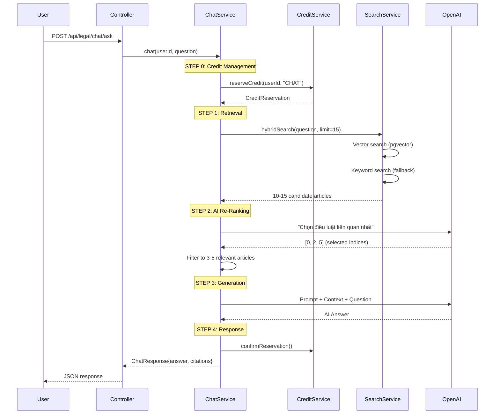

# 🤖 AI Chatbot Module - Code Review

> **Dự án:** Pháp Luật Số - Legal AI Platform  
> **Module:** AI Legal Chatbot (RAG-based)  
> **Ngày review:** 13/01/2026

---

## 📁 Cấu trúc Module

```
src/main/java/com/htai/exe201phapluatso/
├── legal/
│   ├── controller/
│   │   ├── LegalChatController.java     # Chat endpoint
│   │   └── ChatHistoryController.java   # Session management
│   ├── service/
│   │   ├── LegalChatService.java        # Core RAG pipeline
│   │   ├── ChatHistoryService.java      # Session & context
│   │   ├── LegalSearchService.java      # Keyword search
│   │   └── VectorSearchService.java     # Semantic search
│   ├── entity/
│   │   ├── ChatSession.java
│   │   ├── ChatMessage.java
│   │   └── LegalArticle.java
│   └── dto/
│       ├── ChatRequest.java, ChatResponse.java
│       └── ConversationContext.java     # Memory management
├── ai/
│   └── service/
│       ├── OpenAIService.java           # GPT-4o-mini integration
│       └── EmbeddingService.java        # Vector embeddings
└── credit/
    └── service/
        └── CreditService.java           # Reserve/Confirm/Refund
```

---

## 🔄 Logic Flow - RAG Pipeline



---

## 🧠 Key Components Analysis

### 1. LegalChatService - RAG Pipeline

```java
// 3-step RAG with AI re-ranking
public ChatResponse chat(Long userId, String question, ConversationContext context) {
    // STEP 0: Reserve credit (refund if AI fails)
    CreditReservation reservation = creditService.reserveCredit(userId, "CHAT", "AI_CHAT");
    
    try {
        // STEP 1: Retrieve candidates (15 articles)
        List<LegalArticle> candidates = retrieveRelevantArticles(query);
        
        // STEP 2: AI re-rank → 3-5 relevant articles
        List<LegalArticle> relevant = aiReRankArticles(question, candidates);
        
        // STEP 3: Generate answer
        String answer = generateAnswer(question, relevant, context);
        
        // Confirm credit
        creditService.confirmReservation(reservation.getId());
        return new ChatResponse(answer, buildCitations(relevant));
        
    } catch (Exception e) {
        // Refund credit on failure
        creditService.refundReservation(reservation.getId());
        throw e;
    }
}
```

### 2. VectorSearchService - Hybrid Search

```java
// Hybrid search combining vector + keyword
public List<LegalArticle> hybridSearch(String question, int limit) {
    // Generate embedding for question
    float[] embedding = embeddingService.generateEmbedding(question);
    
    // Hybrid SQL with pgvector
    // vector_score * 0.7 + keyword_score * 0.3
    return performHybridSearch(vectorString, keywords, limit);
}
```

**pgvector SQL:**
```sql
WITH scored_articles AS (
    SELECT a.*,
        1 - (a.embedding <=> CAST(:vector AS vector)) AS vector_score,
        (keyword matching score) AS keyword_score
    FROM legal_articles a
    WHERE d.status = 'Còn hiệu lực'
)
SELECT * FROM scored_articles
ORDER BY (vector_score * 0.7 + keyword_score * 0.3) DESC
LIMIT :limit
```

### 3. ConversationContext - Memory Management

```java
// Keeps last 6 messages (3 user + 3 assistant)
private static final int MAX_MESSAGES = 6;

// Extracts "Điều X" references from previous responses
public String getLastAssistantMessage() { ... }
```

### 4. CreditService - Reserve/Confirm/Refund Pattern

```java
// Optimistic locking với retry (tránh race condition)
@Transactional
public CreditReservation reserveCredit(Long userId, String creditType) {
    int attempts = 0;
    while (attempts < MAX_RETRY_ATTEMPTS) {
        try {
            return doReserveCredit(userId, creditType);
        } catch (OptimisticLockingFailureException e) {
            attempts++;
            Thread.sleep(100 * attempts); // Exponential backoff
        }
    }
}
```

---

## ✅ Điểm mạnh (Strengths)

### 1. **RAG với AI Re-Ranking** ⭐⭐⭐
```java
// Thay vì dùng top-N keyword match, AI chọn điều luật THỰC SỰ liên quan
List<LegalArticle> relevant = aiReRankArticles(question, candidates);
```
- Tránh "garbage in, garbage out" 
- Lọc điều luật match keyword nhưng không liên quan
- Prompt rõ ràng: "CHỈ CHỌN điều luật THỰC SỰ CẦN THIẾT"

### 2. **Hybrid Search (Vector + Keyword)** ⭐⭐⭐
```java
SIMILARITY_THRESHOLD = 0.25f;
VECTOR_WEIGHT = 0.7f;  // 70% semantic
KEYWORD_WEIGHT = 0.3f; // 30% keyword
```
- pgvector cho semantic similarity
- Fallback keyword search khi không có embeddings
- Graceful degradation

### 3. **Conversation Context Memory** ⭐⭐⭐
```java
// Hiểu ngữ cảnh từ lịch sử chat
String searchQuery = buildSearchQuery(question, conversationContext);
// Trích xuất "Điều X" từ câu trả lời trước
```
- Hỗ trợ follow-up questions ("còn điều nào khác không?")
- Giới hạn 6 messages để tránh token overflow

### 4. **Credit Reserve/Confirm/Refund** ⭐⭐⭐
```java
// Credit chỉ bị trừ khi AI thành công
reserveCredit() → AI call → confirmReservation()
                   ↓ (fail)
              refundReservation()
```
- User không mất credit khi AI lỗi
- Optimistic locking với retry
- Transaction đảm bảo consistency

### 5. **Prompt Engineering Quality** ⭐⭐
```java
// Prompt có structure rõ ràng
- HƯỚNG DẪN TRẢ LỜI (4 bước)
- QUY TẮC BẮT BUỘC (tối đa 100-150 từ)
- CẤU TRÚC TRẢ LỜI (câu 1: trực tiếp, câu 2-3: giải thích)
```
- Prompt tiếng Việt phù hợp context
- Giới hạn độ dài tránh verbose

### 6. **N+1 Query Prevention** ⭐⭐
```java
// Batch query message counts
Map<Long, Long> messageCounts = getMessageCountsMap(sessionIds);
// Thay vì N queries, dùng 1 batch query
```

### 7. **Robust Fallback Chain** ⭐⭐
```
hybridSearch() → vectorSearch() → keywordSearch() → fallbackArticles()
```
- Graceful degradation khi một layer fail

---

## ⚠️ Điểm yếu & Rủi ro (Weaknesses)

### 1. **Token Overflow Risk** 🔴 HIGH
```java
// Không giới hạn tổng token của context
String context = buildContext(articles); // Có thể rất dài
String prompt = buildPromptWithMemory(question, context, conversationContext);
```
- Nếu 5 articles x 2000 chars = 10,000 chars context
- GPT-4o-mini có limit 128K tokens, nhưng output bị giới hạn

**Khuyến nghị:**
```java
private static final int MAX_CONTEXT_CHARS = 8000;
private String buildContext(List<LegalArticle> articles) {
    StringBuilder context = new StringBuilder();
    int totalChars = 0;
    for (LegalArticle article : articles) {
        String content = truncate(article.getContent(), 1500);
        if (totalChars + content.length() > MAX_CONTEXT_CHARS) break;
        context.append(content);
        totalChars += content.length();
    }
    return context.toString();
}
```

### 2. **No Input Validation on Frontend** 🔴 HIGH
```java
// Chỉ validate ở backend
if (question.length() > 500) {
    throw new BadRequestException("Câu hỏi quá dài (tối đa 500 ký tự)");
}
```
- User có thể đợi lâu rồi mới thấy lỗi
- Nên validate cả frontend trước khi gửi

### 3. **Missing Rate Limiting** 🟡 MEDIUM
```java
@PostMapping("/ask")
public ResponseEntity<ChatResponse> ask(...) {
    // Không có rate limit
}
```
- User có thể spam requests
- API key OpenAI bị rate limit sẽ ảnh hưởng tất cả users

**Khuyến nghị:**
```java
@RateLimiter(name = "legalChat", fallbackMethod = "chatRateLimited")
@PostMapping("/ask")
```

### 4. **Embedding Generation Blocking** 🟡 MEDIUM
```java
// EmbeddingService.generateEmbedding() là sync call
float[] questionEmbedding = embeddingService.generateEmbedding(question);
```
- Blocking main thread trong khi gọi OpenAI embeddings
- Latency tăng thêm 200-500ms mỗi request

**Khuyến nghị:**
- Cache embeddings cho common questions
- Pre-compute embeddings cho frequent patterns

### 5. **AI Re-Ranking Extra API Call** 🟡 MEDIUM
```java
// Cost: 2 API calls per request
aiService.generateText(analysisPrompt);  // Re-ranking
aiService.generateText(prompt);           // Answer generation
```
- Tăng cost và latency
- Nhưng cải thiện chất lượng đáng kể

**Trade-off:** Có thể thêm flag để skip re-ranking cho simple questions

### 6. **Hardcoded Search Config** 🟢 LOW
```java
private static final float SIMILARITY_THRESHOLD = 0.25f;
private static final float VECTOR_WEIGHT = 0.7f;
```
- Nên configurable qua application.yml

### 7. **Session Title Generation** 🟢 LOW
```java
private String generateTitle(String question) {
    if (question.length() <= MAX_TITLE_LENGTH) {
        return question;
    }
    return question.substring(0, MAX_TITLE_LENGTH) + "...";
}
```
- Nên dùng AI tạo title ngắn gọn hơn

---

## 📊 Feature Matrix

| Feature | Status | Notes |
|---------|--------|-------|
| RAG Pipeline | ✅ | 3-step: Retrieve → Re-rank → Generate |
| Vector Search (pgvector) | ✅ | Semantic similarity |
| Keyword Search | ✅ | Fallback with scoring |
| Hybrid Search | ✅ | 70% vector + 30% keyword |
| AI Re-Ranking | ✅ | GPT-4o-mini filters irrelevant |
| Conversation Memory | ✅ | Last 6 messages |
| Credit System | ✅ | Reserve/Confirm/Refund |
| Citation System | ✅ | Links to source articles |
| Session Management | ✅ | Create/List/Delete |
| Streaming Response | ❌ | Not implemented |
| Rate Limiting | ❌ | Not implemented |
| Response Caching | ❌ | Not implemented |
| Feedback Collection | ❌ | Not implemented |

---

## 🔧 Recommendations

### Priority 1 (Critical)
1. **Add token/char limit** cho context để tránh overflow
2. **Add rate limiting** trên chat endpoint
3. **Frontend validation** trước khi gửi request

### Priority 2 (Important)
4. **Streaming response** cho UX tốt hơn (Server-Sent Events)
5. **Response caching** cho frequent questions
6. **Make search config** configurable

### Priority 3 (Nice to have)
7. **Feedback collection** để improve model
8. **AI-generated session titles** ngắn gọn hơn
9. **Analytics dashboard** cho usage patterns

---

## 📝 Kết luận

Module AI Chatbot được implement **rất tốt** với architecture solid:
- ✅ RAG pipeline với AI re-ranking (best practice)
- ✅ Hybrid search (vector + keyword)
- ✅ Conversation context memory
- ✅ Credit system với reserve/confirm/refund
- ✅ Robust fallback chain

Cần cải thiện về **performance** (rate limiting, caching) và **UX** (streaming, frontend validation).

**Overall Quality Score: 8/10** 🤖

---

## 📐 Architecture Diagram

```
┌─────────────────────────────────────────────────────────────────┐
│                        Frontend (legal-chat.html)                │
└─────────────────────────────────┬───────────────────────────────┘
                                  │ POST /api/legal/chat/ask
                                  ▼
┌─────────────────────────────────────────────────────────────────┐
│                     LegalChatController                          │
└─────────────────────────────────┬───────────────────────────────┘
                                  │
                                  ▼
┌─────────────────────────────────────────────────────────────────┐
│                      CreditService                               │
│  ┌──────────────┐    ┌──────────────┐    ┌──────────────┐       │
│  │   Reserve    │───▶│   Operation  │───▶│   Confirm    │       │
│  └──────────────┘    └──────────────┘    └──────────────┘       │
│                             │                                    │
│                             │ (fail)                             │
│                             ▼                                    │
│                      ┌──────────────┐                            │
│                      │    Refund    │                            │
│                      └──────────────┘                            │
└─────────────────────────────────────────────────────────────────┘
                                  │
                                  ▼
┌─────────────────────────────────────────────────────────────────┐
│                     LegalChatService (RAG)                       │
│                                                                  │
│  ┌─────────────────────────────────────────────────────────┐    │
│  │ Step 1: RETRIEVAL                                        │    │
│  │ ┌──────────────┐   ┌──────────────┐   ┌──────────────┐  │    │
│  │ │VectorSearch  │──▶│HybridSearch  │◀──│KeywordSearch │  │    │
│  │ │  (pgvector)  │   │  (fusion)    │   │  (fallback)  │  │    │
│  │ └──────────────┘   └──────────────┘   └──────────────┘  │    │
│  │                           │                              │    │
│  │                    15 Candidate Articles                 │    │
│  └───────────────────────────┼─────────────────────────────┘    │
│                              ▼                                   │
│  ┌─────────────────────────────────────────────────────────┐    │
│  │ Step 2: AI RE-RANKING (GPT-4o-mini)                     │    │
│  │ "Chọn điều luật THỰC SỰ liên quan" → 3-5 articles       │    │
│  └───────────────────────────┼─────────────────────────────┘    │
│                              ▼                                   │
│  ┌─────────────────────────────────────────────────────────┐    │
│  │ Step 3: GENERATION (GPT-4o-mini)                        │    │
│  │ Prompt + Context + ConversationHistory → Answer         │    │
│  └───────────────────────────┼─────────────────────────────┘    │
└──────────────────────────────┼──────────────────────────────────┘
                               ▼
                    ChatResponse {answer, citations}
```
