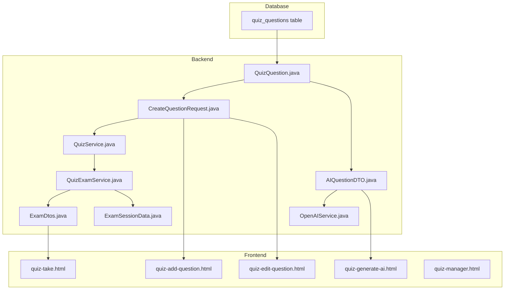

# 📋 Implementation Plan: Multiple Choice Questions Feature

## 1. Tổng Quan

### 1.1 Mục Tiêu
Mở rộng hệ thống Quiz để hỗ trợ **nhiều loại câu hỏi** thay vì chỉ Single Choice (1 đáp án đúng trong 4 đáp án).

### 1.2 Các Loại Câu Hỏi Được Hỗ Trợ

| Type | Mô tả | Số options | Số đáp án đúng | UI Input |
|------|-------|------------|----------------|----------|
| `SINGLE` | Một đáp án đúng (mặc định) | 2-6 | 1 | Radio buttons |
| `MULTIPLE` | Nhiều đáp án đúng | 2-6 | 2+ | Checkboxes |
| `TRUE_FALSE` | Đúng hoặc Sai | 2 (cố định) | 1 | Radio buttons |

### 1.3 Chi Tiết TRUE_FALSE

```
Câu hỏi: "Theo Luật Dân sự 2015, pháp nhân có thể là thừa kế theo di chúc."
- ✅ Đúng
- ❌ Sai
→ Đáp án: Đúng
```

> [!NOTE]
> **Backward compatible**: Tất cả câu hỏi hiện có mặc định là `SINGLE`.

---

## 2. Phân Tích Các File Cần Thay Đổi



---

## 3. Chi Tiết Thay Đổi

### Phase 1: Database Schema

#### [MODIFY] quiz_questions table
Thêm column `question_type`:

```sql
-- Migration script
ALTER TABLE quiz_questions 
ADD COLUMN question_type VARCHAR(20) NOT NULL DEFAULT 'SINGLE';

-- Constraint
ALTER TABLE quiz_questions 
ADD CONSTRAINT check_question_type 
CHECK (question_type IN ('SINGLE', 'MULTIPLE', 'TRUE_FALSE'));
```

> [!IMPORTANT]
> Migration phải backward compatible - tất cả câu hỏi cũ sẽ có `question_type = 'SINGLE'` mặc định.

---

### Phase 2: Backend Entities & DTOs

#### [MODIFY] [QuizQuestion.java](file:///c:/Users/Chung/IdeaProjects/EXE201_PhapLuatSo/src/main/java/com/htai/exe201phapluatso/quiz/entity/QuizQuestion.java)

```diff
+@Column(name = "question_type", nullable = false, length = 20)
+private String questionType = "SINGLE"; // SINGLE, MULTIPLE

+public String getQuestionType() { return questionType; }
+public void setQuestionType(String questionType) { this.questionType = questionType; }
```

---

#### [MODIFY] [CreateQuestionRequest.java](file:///c:/Users/Chung/IdeaProjects/EXE201_PhapLuatSo/src/main/java/com/htai/exe201phapluatso/quiz/dto/CreateQuestionRequest.java)

```diff
 public record CreateQuestionRequest(
         @NotBlank String questionText,
         String explanation,
+        String questionType,  // SINGLE (default) hoặc MULTIPLE
         @NotNull @Valid List<OptionDto> options
 ) {}
```

---

#### [MODIFY] [AIQuestionDTO.java](file:///c:/Users/Chung/IdeaProjects/EXE201_PhapLuatSo/src/main/java/com/htai/exe201phapluatso/ai/dto/AIQuestionDTO.java)

**Thay đổi lớn**: Chuyển từ `optionA, optionB, optionC, optionD, correctAnswer` sang cấu trúc động:

```java
public record AIQuestionDTO(
    String question,
    String questionType,  // "SINGLE" hoặc "MULTIPLE"
    List<OptionItem> options,  // Dynamic list thay vì fixed A,B,C,D
    List<String> correctAnswers,  // ["A"] cho single, ["A","C"] cho multiple
    String explanation
) {
    public record OptionItem(String key, String text) {}
    
    // Backward compatibility helper
    public String getCorrectAnswer() {
        return correctAnswers != null && !correctAnswers.isEmpty() 
            ? correctAnswers.get(0) : null;
    }
}
```

---

#### [MODIFY] [ExamDtos.java](file:///c:/Users/Chung/IdeaProjects/EXE201_PhapLuatSo/src/main/java/com/htai/exe201phapluatso/quiz/dto/ExamDtos.java)

```diff
 public record ExamQuestionDto(
         Long id,
         String questionText,
+        String questionType,  // SINGLE hoặc MULTIPLE
         String explanation,
         List<ExamOptionDto> options,
-        String correctOptionKey
+        List<String> correctOptionKeys  // Multiple correct answers
 ) {}

 public record SubmitExamRequest(
         List<AnswerDto> answers
 ) {
     public record AnswerDto(
             Long questionId,
-            String selectedOptionKey
+            List<String> selectedOptionKeys  // Support multiple selections
     ) {}
 }

 public record WrongQuestionDto(
         Long questionId,
         String questionText,
+        String questionType,
-        String correctOptionKey,
-        String selectedOptionKey,
+        List<String> correctOptionKeys,
+        List<String> selectedOptionKeys,
         String explanation,
         List<ExamOptionDto> options
 ) {}
```

---

#### [MODIFY] [ExamSessionData.java](file:///c:/Users/Chung/IdeaProjects/EXE201_PhapLuatSo/src/main/java/com/htai/exe201phapluatso/quiz/dto/ExamSessionData.java)

```diff
 public record ExamSessionData(
-        Map<Long, String> correctKeyMapping,  // questionId -> single correct key
+        Map<Long, List<String>> correctKeysMapping,  // questionId -> list of correct keys
+        Map<Long, String> questionTypeMapping,  // questionId -> SINGLE/MULTIPLE
         Map<Long, List<ExamOptionDto>> shuffledOptionsMapping,
         LocalDateTime startedAt,
         long createdAt
 ) {}
```

---

### Phase 3: Backend Services

#### [MODIFY] [QuizService.java](file:///c:/Users/Chung/IdeaProjects/EXE201_PhapLuatSo/src/main/java/com/htai/exe201phapluatso/quiz/service/QuizService.java)

```diff
-private void validateOptions(List<OptionDto> options) {
-    if (options == null || options.size() != 4) {
-        throw new BadRequestException("Phải có đúng 4 đáp án");
+private void validateOptions(List<OptionDto> options, String questionType) {
+    if (options == null || options.size() < 2 || options.size() > 6) {
+        throw new BadRequestException("Phải có từ 2-6 đáp án");
     }
     
+    // Generate expected keys based on options count
+    Set<String> expectedKeys = generateExpectedKeys(options.size());
     Set<String> keys = options.stream()
             .map(o -> o.optionKey().trim().toUpperCase())
             .collect(Collectors.toSet());
-    if (!keys.equals(Set.of("A", "B", "C", "D"))) {
-        throw new BadRequestException("Đáp án phải có các key: A, B, C, D");
+    if (!keys.equals(expectedKeys)) {
+        throw new BadRequestException("Đáp án phải có các key: " + expectedKeys);
     }

     long correctCount = options.stream()
             .filter(OptionDto::isCorrect)
             .count();

-    if (correctCount != 1) {
-        throw new BadRequestException("Phải có đúng 1 đáp án đúng");
+    if ("TRUE_FALSE".equals(questionType)) {
+        if (options.size() != 2) {
+            throw new BadRequestException("Câu hỏi Đúng/Sai phải có đúng 2 đáp án");
+        }
+        if (correctCount != 1) {
+            throw new BadRequestException("Câu hỏi Đúng/Sai phải có đúng 1 đáp án đúng");
+        }
+    } else if ("SINGLE".equals(questionType)) {
+        if (correctCount != 1) {
+            throw new BadRequestException("Câu hỏi Single Choice phải có đúng 1 đáp án đúng");
+        }
+    } else if ("MULTIPLE".equals(questionType)) {
+        if (correctCount < 2) {
+            throw new BadRequestException("Câu hỏi Multiple Choice phải có ít nhất 2 đáp án đúng");
+        }
+    }
+}
+
+private Set<String> generateExpectedKeys(int count) {
+    return IntStream.range(0, count)
+            .mapToObj(i -> String.valueOf((char) ('A' + i)))
+            .collect(Collectors.toSet());
 }
```

---

#### [MODIFY] [QuizExamService.java](file:///c:/Users/Chung/IdeaProjects/EXE201_PhapLuatSo/src/main/java/com/htai/exe201phapluatso/quiz/service/QuizExamService.java)

**Thay đổi chính:**
1. `startExam()`: Lưu `correctKeysMapping` (List) thay vì `correctKeyMapping` (String)
2. `submitExam()`: So sánh Set thay vì String cho Multiple Choice
3. Tính điểm: Partial credit cho Multiple Choice (tùy chọn)

```diff
-Map<Long, String> correctKeyMapping = new HashMap<>();
+Map<Long, List<String>> correctKeysMapping = new HashMap<>();
+Map<Long, String> questionTypeMapping = new HashMap<>();

// Trong startExam()
-correctKeyMapping.put(question.getId(), newCorrectKey);
+List<String> correctKeys = new ArrayList<>();
+for (int i = 0; i < originalOptions.size(); i++) {
+    if (originalOptions.get(i).isCorrect()) {
+        correctKeys.add(OPTION_KEYS.get(i));
+    }
+}
+correctKeysMapping.put(question.getId(), correctKeys);
+questionTypeMapping.put(question.getId(), question.getQuestionType());

// Trong submitExam() - so sánh logic
-boolean isCorrect = selectedKey != null && correctKey.equalsIgnoreCase(selectedKey);
+Set<String> selectedSet = new HashSet<>(selectedKeys);
+Set<String> correctSet = new HashSet<>(correctKeys);
+boolean isCorrect = selectedSet.equals(correctSet);
```

---

#### [MODIFY] [OpenAIService.java](file:///c:/Users/Chung/IdeaProjects/EXE201_PhapLuatSo/src/main/java/com/htai/exe201phapluatso/ai/service/OpenAIService.java)

**Thay đổi prompt để hỗ trợ Multiple Choice:**

```diff
-FORMAT JSON:
-[
-  {
-    "question": "...",
-    "optionA": "...",
-    "optionB": "...",
-    "optionC": "...",
-    "optionD": "...",
-    "correctAnswer": "A",
-    "explanation": "..."
-  }
-]

+FORMAT JSON:
+[
+  {
+    "question": "...",
+    "questionType": "SINGLE",  // hoặc "MULTIPLE"
+    "options": [
+      {"key": "A", "text": "..."},
+      {"key": "B", "text": "..."},
+      {"key": "C", "text": "..."},
+      {"key": "D", "text": "..."}
+    ],
+    "correctAnswers": ["A"],  // hoặc ["A", "C"] cho Multiple
+    "explanation": "..."
+  }
+]
```

**Thêm tham số để user chọn tạo Multiple Choice:**

```diff
-public List<AIQuestionDTO> generateQuestions(String documentText, int count) {
+public List<AIQuestionDTO> generateQuestions(
+        String documentText, 
+        int count,
+        boolean includeMultipleChoice  // true = mix SINGLE và MULTIPLE
+) {
```

---

#### [MODIFY] [AIQuizService.java](file:///c:/Users/Chung/IdeaProjects/EXE201_PhapLuatSo/src/main/java/com/htai/exe201phapluatso/ai/service/AIQuizService.java)

```diff
 private QuizQuestion createQuestionFromAI(AIQuestionDTO aiQ, QuizSet quizSet, int orderIndex) {
     QuizQuestion question = new QuizQuestion();
     question.setQuizSet(quizSet);
     question.setQuestionText(sanitizeInput(aiQ.question()));
+    question.setQuestionType(aiQ.questionType() != null ? aiQ.questionType() : "SINGLE");
     question.setExplanation(sanitizeInput(aiQ.explanation()));
     
-    // Create options - hardcoded A,B,C,D
-    options.add(createOption(question, "A", sanitizeInput(aiQ.optionA()), aiQ.correctAnswer().equals("A")));
+    // Create options - dynamic from AI response
+    for (AIQuestionDTO.OptionItem opt : aiQ.options()) {
+        boolean isCorrect = aiQ.correctAnswers().contains(opt.key());
+        options.add(createOption(question, opt.key(), sanitizeInput(opt.text()), isCorrect));
+    }
 }
```

---

### Phase 4: Frontend - Tạo Câu Hỏi Thủ Công

#### [MODIFY] [quiz-add-question.html](file:///c:/Users/Chung/IdeaProjects/EXE201_PhapLuatSo/src/main/resources/static/html/quiz-add-question.html)

**Thay đổi UI:**
1. Thêm dropdown chọn `Question Type` (Single/Multiple)
2. Thay Radio buttons thành Checkboxes khi chọn Multiple
3. Thêm nút Add/Remove option (min 2, max 6)

```html
<!-- Question Type Selector -->
<div class="mb-3">
    <label class="form-label">Loại câu hỏi</label>
    <select class="form-select" id="questionType">
        <option value="SINGLE" selected>Single Choice (1 đáp án đúng)</option>
        <option value="MULTIPLE">Multiple Choice (nhiều đáp án đúng)</option>
        <option value="TRUE_FALSE">Đúng/Sai</option>
    </select>
</div>

<!-- Dynamic Options Container -->
<div id="optionsContainer">
    <!-- Options sẽ được render động bằng JS -->
</div>
<button type="button" id="addOptionBtn" class="btn btn-outline-primary btn-sm">
    <i class="bi bi-plus"></i> Thêm đáp án
</button>
```

**JavaScript Logic:**
```javascript
// Toggle UI dựa trên question type
document.getElementById('questionType').addEventListener('change', (e) => {
    const type = e.target.value;
    
    if (type === 'TRUE_FALSE') {
        // Auto-generate 2 fixed options
        renderTrueFalseOptions();
    } else {
        const inputType = type === 'MULTIPLE' ? 'checkbox' : 'radio';
        renderDynamicOptions(inputType);
    }
});

// Render TRUE_FALSE options (cố định, không thêm/xóa được)
function renderTrueFalseOptions() {
    optionsContainer.innerHTML = `
        <div class="option-item">
            <input type="radio" name="correctOption" value="A" id="correctA">
            <label for="correctA"><strong>A.</strong> Đúng</label>
        </div>
        <div class="option-item">
            <input type="radio" name="correctOption" value="B" id="correctB">
            <label for="correctB"><strong>B.</strong> Sai</label>
        </div>
    `;
    // Ẩn nút Add/Remove option
    addOptionBtn.style.display = 'none';
}

// Dynamic add/remove options (cho SINGLE và MULTIPLE)
function addOption() {
    if (optionCount >= 6) return;
    optionCount++;
    const key = String.fromCharCode(64 + optionCount); // A, B, C...
    // Append new option HTML
}
```

---

#### [MODIFY] [quiz-edit-question.html](file:///c:/Users/Chung/IdeaProjects/EXE201_PhapLuatSo/src/main/resources/static/html/quiz-edit-question.html)

Tương tự `quiz-add-question.html` - load `questionType` từ API và render phù hợp.

---

### Phase 5: Frontend - Làm Bài Kiểm Tra

#### [MODIFY] [quiz-take.html](file:///c:/Users/Chung/IdeaProjects/EXE201_PhapLuatSo/src/main/resources/static/html/quiz-take.html)

**Thay đổi:**
1. Hiển thị indicator `(Chọn nhiều đáp án)` cho Multiple Choice
2. Render checkboxes thay vì radio cho Multiple Choice
3. Lưu `selectedOptionKeys` (array) thay vì `selectedOptionKey` (string)

```javascript
// Render based on question type
function renderCurrentQuestion() {
    const q = examQuestions[currentIndex];
    const isMultiple = q.questionType === 'MULTIPLE';
    
    const optionsHtml = q.options.map(opt => {
        const inputType = isMultiple ? 'checkbox' : 'radio';
        const selected = answers[q.id]?.includes(opt.optionKey);
        return `
            <div class="option-item ${selected ? 'selected' : ''}" 
                 data-option-key="${opt.optionKey}"
                 data-input-type="${inputType}">
                ...
            </div>
        `;
    }).join('');
    
    // Add hint for multiple choice
    const hint = isMultiple 
        ? '<p class="text-info"><i class="bi bi-info-circle"></i> Chọn tất cả đáp án đúng</p>' 
        : '';
}

// Handle selection
function handleOptionClick(questionId, optionKey, isMultiple) {
    if (isMultiple) {
        // Toggle in array
        const current = answers[questionId] || [];
        if (current.includes(optionKey)) {
            answers[questionId] = current.filter(k => k !== optionKey);
        } else {
            answers[questionId] = [...current, optionKey];
        }
    } else {
        // Replace single value
        answers[questionId] = [optionKey];
    }
}

// Submit format change
const payload = {
    answers: examQuestions.map(q => ({
        questionId: q.id,
        selectedOptionKeys: answers[q.id] || []  // Always array
    }))
};
```

---

### Phase 6: Frontend - Tạo Bằng AI

#### [MODIFY] [quiz-generate-ai.html](file:///c:/Users/Chung/IdeaProjects/EXE201_PhapLuatSo/src/main/resources/static/html/quiz-generate-ai.html)

**Thêm option:**
```html
<div class="form-check">
    <input class="form-check-input" type="checkbox" id="includeMultipleChoice">
    <label class="form-check-label" for="includeMultipleChoice">
        Bao gồm câu hỏi Multiple Choice (nhiều đáp án đúng)
    </label>
</div>
```

**Gửi thêm param:**
```javascript
formData.append('includeMultipleChoice', document.getElementById('includeMultipleChoice').checked);
```

---

## 4. Chi Tiết Files Cần Thay Đổi

| File | Type | Changes |
|------|------|---------|
| [QuizQuestion.java](file:///c:/Users/Chung/IdeaProjects/EXE201_PhapLuatSo/src/main/java/com/htai/exe201phapluatso/quiz/entity/QuizQuestion.java) | Entity | +`questionType` field |
| [CreateQuestionRequest.java](file:///c:/Users/Chung/IdeaProjects/EXE201_PhapLuatSo/src/main/java/com/htai/exe201phapluatso/quiz/dto/CreateQuestionRequest.java) | DTO | +`questionType` field |
| [AIQuestionDTO.java](file:///c:/Users/Chung/IdeaProjects/EXE201_PhapLuatSo/src/main/java/com/htai/exe201phapluatso/ai/dto/AIQuestionDTO.java) | DTO | Rewrite to support dynamic options |
| [ExamDtos.java](file:///c:/Users/Chung/IdeaProjects/EXE201_PhapLuatSo/src/main/java/com/htai/exe201phapluatso/quiz/dto/ExamDtos.java) | DTO | List instead of single values |
| [ExamSessionData.java](file:///c:/Users/Chung/IdeaProjects/EXE201_PhapLuatSo/src/main/java/com/htai/exe201phapluatso/quiz/dto/ExamSessionData.java) | DTO | Update mappings |
| [QuizService.java](file:///c:/Users/Chung/IdeaProjects/EXE201_PhapLuatSo/src/main/java/com/htai/exe201phapluatso/quiz/service/QuizService.java) | Service | Update validation logic |
| [QuizExamService.java](file:///c:/Users/Chung/IdeaProjects/EXE201_PhapLuatSo/src/main/java/com/htai/exe201phapluatso/quiz/service/QuizExamService.java) | Service | Update scoring logic |
| [OpenAIService.java](file:///c:/Users/Chung/IdeaProjects/EXE201_PhapLuatSo/src/main/java/com/htai/exe201phapluatso/ai/service/OpenAIService.java) | Service | Update prompt & parsing |
| [AIQuizService.java](file:///c:/Users/Chung/IdeaProjects/EXE201_PhapLuatSo/src/main/java/com/htai/exe201phapluatso/ai/service/AIQuizService.java) | Service | Handle new DTO format |
| [quiz-add-question.html](file:///c:/Users/Chung/IdeaProjects/EXE201_PhapLuatSo/src/main/resources/static/html/quiz-add-question.html) | Frontend | Dynamic options UI |
| [quiz-edit-question.html](file:///c:/Users/Chung/IdeaProjects/EXE201_PhapLuatSo/src/main/resources/static/html/quiz-edit-question.html) | Frontend | Same as add |
| [quiz-take.html](file:///c:/Users/Chung/IdeaProjects/EXE201_PhapLuatSo/src/main/resources/static/html/quiz-take.html) | Frontend | Checkbox for multiple, array answers |
| [quiz-generate-ai.html](file:///c:/Users/Chung/IdeaProjects/EXE201_PhapLuatSo/src/main/resources/static/html/quiz-generate-ai.html) | Frontend | Option to include multiple choice |
| [quiz-manager.html](file:///c:/Users/Chung/IdeaProjects/EXE201_PhapLuatSo/src/main/resources/static/html/quiz-manager.html) | Frontend | Display question type badge |

---

## 5. Verification Plan

### 5.1 Manual Testing (User thực hiện)

#### Test 1: Tạo câu hỏi Single Choice thủ công
1. Đăng nhập vào hệ thống
2. Vào **Bộ đề** → Chọn/tạo bộ đề → **Thêm câu hỏi**
3. Điền nội dung câu hỏi
4. Mặc định đã chọn "Single Choice"
5. Nhập 4 đáp án, chọn 1 đáp án đúng
6. Click **Lưu**
7. **Kiểm tra**: Câu hỏi được lưu, hiển thị trong danh sách

#### Test 2: Tạo câu hỏi Multiple Choice thủ công
1. Vào **Thêm câu hỏi**
2. Chọn **Multiple Choice** từ dropdown
3. **Kiểm tra**: Radio buttons chuyển thành Checkboxes
4. Click **Thêm đáp án** 2 lần (tổng 6 đáp án)
5. Chọn 3 đáp án đúng (checked)
6. Click **Lưu**
7. **Kiểm tra**: Câu hỏi được lưu với type MULTIPLE

#### Test 3: Làm bài với Multiple Choice
1. Vào bộ đề có câu hỏi Multiple Choice
2. Click **Làm bài**
3. **Kiểm tra** câu Multiple Choice:
   - Hiển thị hint "(Chọn nhiều đáp án)"
   - Click được nhiều options (checkboxes)
4. Submit bài
5. **Kiểm tra kết quả**:
   - Đúng hoàn toàn: điểm full
   - Đúng 1 phần: điểm 0 (hoặc partial - tùy logic)

#### Test 4: AI Generate với Multiple Choice
1. Vào **Tạo đề bằng AI**
2. Upload file
3. Check vào **Bao gồm câu hỏi Multiple Choice**
4. Click **Tạo**
5. **Kiểm tra**: Kết quả có cả SINGLE và MULTIPLE questions

#### Test 5: Backward Compatibility
1. Làm bài với bộ đề cũ (chỉ có Single Choice)
2. **Kiểm tra**: Hoạt động bình thường như trước

#### Test 6: Tạo và làm câu hỏi Đúng/Sai
1. Vào **Thêm câu hỏi** → Chọn **Đúng/Sai**
2. **Kiểm tra**: Chỉ hiển thị 2 options cố định (Đúng, Sai)
3. **Kiểm tra**: Không thể thêm/xóa options
4. Chọn đáp án đúng → Click **Lưu**
5. Làm bài kiểm tra với câu Đúng/Sai
6. **Kiểm tra**: Hiển thị và chấm điểm đúng

### 5.2 Build Verification

```bash
# Chạy trong project directory
cd c:\Users\Chung\IdeaProjects\EXE201_PhapLuatSo

# Build project
.\mvnw.cmd clean compile -DskipTests

# Kiểm tra không có lỗi compilation
```

### 5.3 Database Migration Verification

```sql
-- Sau khi chạy migration, kiểm tra:
SELECT question_type, COUNT(*) 
FROM quiz_questions 
GROUP BY question_type;

-- Kết quả mong đợi:
-- SINGLE | (số câu hỏi cũ + mới single)
-- MULTIPLE | (số câu hỏi multiple mới)
```

---

## 6. Thứ Tự Triển Khai

> [!IMPORTANT]
> Triển khai theo thứ tự này để đảm bảo backward compatibility.

1. **Phase 1**: Database migration (thêm column với default)
2. **Phase 2**: Backend Entities & DTOs (nhưng giữ logic cũ hoạt động)
3. **Phase 3**: Backend Services (update validation + scoring)
4. **Phase 4**: Frontend tạo câu hỏi thủ công
5. **Phase 5**: Frontend làm bài kiểm tra
6. **Phase 6**: Frontend AI generation
7. **Testing**: Manual tests theo plan ở trên

---

## 7. Risks & Mitigations

| Risk | Impact | Mitigation |
|------|--------|------------|
| Breaking existing quizzes | High | Default `question_type = 'SINGLE'` cho tất cả câu hỏi cũ |
| OpenAI prompt không ổn định | Medium | Validate response, fallback to SINGLE nếu parse fail |
| Frontend state management phức tạp | Medium | Sử dụng consistent data structure (always array) |
| Scoring partial credit gây confusion | Low | Phase 1: No partial credit, chỉ full correct |

---

## User Review Required

> [!CAUTION]
> Trước khi triển khai, xin xác nhận các quyết định sau:

1. **Scoring cho Multiple Choice**: 
   - Option A: All-or-nothing (phải chọn đúng hết mới được điểm)
   - Option B: Partial credit (ví dụ: đúng 2/3 được 66% điểm)
   
2. **AI Generation**: 
   - Có muốn cho phép chọn % câu Multiple Choice không? (ví dụ: 30% multiple, 70% single)
   
3. **Số lượng options**:
   - Min 2, Max 6 có phù hợp không?

Vui lòng review và cho feedback trước khi tôi bắt tay vào code.
