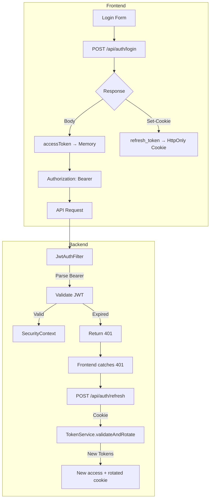

# Auth System Comprehensive Review

> **Kết quả**: Hệ thống sử dụng mô hình **Refresh token in HttpOnly cookie + Access token in memory** - đây là mô hình bảo mật tiên tiến và **phù hợp cho production**.

---

## 1. Context Map - File/Endpoint Liên Quan

### 1.1 Backend Files (50+ files)

#### Controllers
| File | Vai trò |
|------|---------|
| [AuthController.java](file:///c:/Users/Chung/IdeaProjects/EXE201_PhapLuatSo_Spring26/src/main/java/com/htai/exe201phapluatso/auth/controller/AuthController.java) | Login/refresh/logout/me endpoints |
| [PasswordResetController.java](file:///c:/Users/Chung/IdeaProjects/EXE201_PhapLuatSo_Spring26/src/main/java/com/htai/exe201phapluatso/auth/controller/PasswordResetController.java) | OTP-based password reset |
| [UserController.java](file:///c:/Users/Chung/IdeaProjects/EXE201_PhapLuatSo_Spring26/src/main/java/com/htai/exe201phapluatso/auth/controller/UserController.java) | User profile management |

#### Services
| File | Vai trò |
|------|---------|
| [AuthService.java](file:///c:/Users/Chung/IdeaProjects/EXE201_PhapLuatSo_Spring26/src/main/java/com/htai/exe201phapluatso/auth/service/AuthService.java) | Register/login/refresh/logout logic |
| [TokenService.java](file:///c:/Users/Chung/IdeaProjects/EXE201_PhapLuatSo_Spring26/src/main/java/com/htai/exe201phapluatso/auth/service/TokenService.java) | Refresh token rotation + reuse detection |
| [JwtService.java](file:///c:/Users/Chung/IdeaProjects/EXE201_PhapLuatSo_Spring26/src/main/java/com/htai/exe201phapluatso/auth/service/JwtService.java) | Access token sign/verify |
| [AccountLockoutService.java](file:///c:/Users/Chung/IdeaProjects/EXE201_PhapLuatSo_Spring26/src/main/java/com/htai/exe201phapluatso/auth/service/AccountLockoutService.java) | Brute-force protection |
| [SecurityAuditService.java](file:///c:/Users/Chung/IdeaProjects/EXE201_PhapLuatSo_Spring26/src/main/java/com/htai/exe201phapluatso/auth/service/SecurityAuditService.java) | Security event logging |
| [PasswordResetService.java](file:///c:/Users/Chung/IdeaProjects/EXE201_PhapLuatSo_Spring26/src/main/java/com/htai/exe201phapluatso/auth/service/PasswordResetService.java) | OTP generation/validation |
| [EmailVerificationService.java](file:///c:/Users/Chung/IdeaProjects/EXE201_PhapLuatSo_Spring26/src/main/java/com/htai/exe201phapluatso/auth/service/EmailVerificationService.java) | Email verification tokens |

#### Security
| File | Vai trò |
|------|---------|
| [SecurityConfig.java](file:///c:/Users/Chung/IdeaProjects/EXE201_PhapLuatSo_Spring26/src/main/java/com/htai/exe201phapluatso/auth/security/SecurityConfig.java) | CORS, CSRF, endpoint security |
| [JwtAuthFilter.java](file:///c:/Users/Chung/IdeaProjects/EXE201_PhapLuatSo_Spring26/src/main/java/com/htai/exe201phapluatso/auth/security/JwtAuthFilter.java) | Validate Bearer token from header |
| [RateLimitFilter.java](file:///c:/Users/Chung/IdeaProjects/EXE201_PhapLuatSo_Spring26/src/main/java/com/htai/exe201phapluatso/auth/security/RateLimitFilter.java) | API rate limiting |
| [AuthUserPrincipal.java](file:///c:/Users/Chung/IdeaProjects/EXE201_PhapLuatSo_Spring26/src/main/java/com/htai/exe201phapluatso/auth/security/AuthUserPrincipal.java) | JWT claims → Principal |

#### OAuth2
| File | Vai trò |
|------|---------|
| [OAuth2AuthenticationSuccessHandler.java](file:///c:/Users/Chung/IdeaProjects/EXE201_PhapLuatSo_Spring26/src/main/java/com/htai/exe201phapluatso/auth/oauth2/OAuth2AuthenticationSuccessHandler.java) | Google login → set cookie + redirect |
| [OAuth2AuthenticationFailureHandler.java](file:///c:/Users/Chung/IdeaProjects/EXE201_PhapLuatSo_Spring26/src/main/java/com/htai/exe201phapluatso/auth/oauth2/OAuth2AuthenticationFailureHandler.java) | OAuth failure handling |
| [CustomOAuth2UserService.java](file:///c:/Users/Chung/IdeaProjects/EXE201_PhapLuatSo_Spring26/src/main/java/com/htai/exe201phapluatso/auth/oauth2/CustomOAuth2UserService.java) | Load/create user from OAuth |

#### Utilities
| File | Vai trò |
|------|---------|
| [CookieUtils.java](file:///c:/Users/Chung/IdeaProjects/EXE201_PhapLuatSo_Spring26/src/main/java/com/htai/exe201phapluatso/auth/util/CookieUtils.java) | HttpOnly cookie management |

#### Entities
| File | Vai trò |
|------|---------|
| `User.java` | User entity with roles |
| `RefreshToken.java` | Refresh token with usedAt, revokedAt |
| `Role.java` | User roles (STUDENT, ADMIN) |
| `PasswordResetOtp.java` | OTP for password reset |
| `EmailVerificationToken.java` | Email verification token |
| `SecurityAuditLog.java` | Audit trail |

#### DTOs
| File | Vai trò |
|------|---------|
| `LoginRequest.java` | email + password |
| `RegisterRequest.java` | Registration fields |
| `TokenResponse.java` | accessToken + refreshToken (internal) |
| `AccessTokenResponse.java` | accessToken + expiresIn (client response) |

---

### 1.2 Frontend Files (JavaScript)

| File | Vai trò |
|------|---------|
| [token-manager.js](file:///c:/Users/Chung/IdeaProjects/EXE201_PhapLuatSo_Spring26/src/main/resources/static/scripts/token-manager.js) | In-memory access token storage, refresh via cookie |
| [auth-guard.js](file:///c:/Users/Chung/IdeaProjects/EXE201_PhapLuatSo_Spring26/src/main/resources/static/scripts/auth-guard.js) | Route protection, rehydration, role checks |
| [api-client.js](file:///c:/Users/Chung/IdeaProjects/EXE201_PhapLuatSo_Spring26/src/main/resources/static/scripts/api-client.js) | 401 auto-refresh, Authorization header |
| [script.js](file:///c:/Users/Chung/IdeaProjects/EXE201_PhapLuatSo_Spring26/src/main/resources/static/scripts/script.js) | Navbar user info, logout handler |

### 1.3 Frontend Pages (HTML)

| File | Vai trò |
|------|---------|
| [login.html](file:///c:/Users/Chung/IdeaProjects/EXE201_PhapLuatSo_Spring26/src/main/resources/static/html/login.html) | Email/password form, Google OAuth button |
| [register.html](file:///c:/Users/Chung/IdeaProjects/EXE201_PhapLuatSo_Spring26/src/main/resources/static/html/register.html) | Registration form |
| [oauth2-redirect.html](file:///c:/Users/Chung/IdeaProjects/EXE201_PhapLuatSo_Spring26/src/main/resources/static/html/oauth2-redirect.html) | Handle OAuth callback, store token in memory |
| [forgot-password.html](file:///c:/Users/Chung/IdeaProjects/EXE201_PhapLuatSo_Spring26/src/main/resources/static/html/forgot-password.html) | OTP request form |
| [reset-password.html](file:///c:/Users/Chung/IdeaProjects/EXE201_PhapLuatSo_Spring26/src/main/resources/static/html/reset-password.html) | OTP verification + new password |

---

### 1.4 Auth Endpoints

| Method | Endpoint | Auth | Vai trò |
|--------|----------|------|---------|
| POST | `/api/auth/register` | Public | Đăng ký tài khoản |
| POST | `/api/auth/login` | Public | Đăng nhập → access token (body) + refresh cookie |
| POST | `/api/auth/refresh` | Cookie | Refresh → new tokens (rotate) |
| POST | `/api/auth/logout` | Cookie | Revoke refresh token + clear cookie |
| GET | `/api/auth/me` | Bearer | Lấy thông tin user hiện tại |
| POST | `/api/auth/verify-email` | Public | Xác thực email |
| POST | `/api/auth/resend-verification` | Public | Gửi lại email xác thực |
| POST | `/api/auth/password-reset/send-otp` | Public | Gửi OTP reset password |
| POST | `/api/auth/password-reset/reset` | Public | Reset password với OTP |
| GET | `/oauth2/authorization/google` | Public | Redirect to Google OAuth |

---

## 2. Token Consistency Matrix

| Flow | Access Token Location | Refresh Token Location | Transport Mechanism | Status |
|------|----------------------|------------------------|---------------------|--------|
| **Login (email/pass)** | Response body → Memory | HttpOnly cookie (Set-Cookie) | Authorization header | ✅ Consistent |
| **Login (Google OAuth)** | URL param → Memory | HttpOnly cookie (Set-Cookie) | Authorization header | ✅ Consistent |
| **Refresh** | Response body → Memory | HttpOnly cookie (rotated) | Cookie auto-sent | ✅ Consistent |
| **Logout** | Cleared from memory | Cookie cleared (Max-Age=0) | Cookie auto-sent | ✅ Consistent |
| **API Calls** | Memory → Header | Cookie (unused for API) | Authorization: Bearer | ✅ Consistent |
| **Password Reset** | N/A (no token) | N/A | Email OTP | ✅ Consistent |

> **✅ VERDICT: 100% CONSISTENT** - Không có localStorage token, không có hybrid model.

---

## 3. Security Model Analysis

### 3.1 Current Model: Refresh Cookie + Access Memory



### 3.2 Token Flow Details

**Login:**
```
1. User submits email/password
2. Backend validates credentials
3. Backend creates:
   - Access JWT (15 min TTL, in-memory secret)
   - Refresh token (7 days, hashed in DB)
4. Response:
   - Body: { accessToken, expiresIn }
   - Header: Set-Cookie: refresh_token=xxx; HttpOnly; SameSite=Lax; Path=/api/auth
5. Frontend:
   - TokenManager.setAccessToken(token, expiry) → stored in JS variable
   - localStorage.set(userName, role) → for UI display only
```

**Refresh (Rehydration):**
```
1. Page load → no token in memory
2. AUTH.guard() → calls TokenManager.refreshAccessToken()
3. POST /api/auth/refresh with credentials:include
4. Browser auto-sends refresh_token cookie
5. Backend:
   - Finds token by hash
   - Checks usedAt (reuse detection with 30s grace)
   - Issues new access + refresh tokens
   - Marks old token as used
6. Response → new access to memory, new cookie rotated
```

**Logout:**
```
1. TokenManager.logout()
2. POST /api/auth/logout with credentials:include
3. Backend revokes token in DB
4. Response clears cookie via Set-Cookie Max-Age=0
5. Frontend clears memory + localStorage
```

### 3.3 Security Features Implemented

| Feature | Status | Implementation |
|---------|--------|----------------|
| **XSS Protection** | ✅ | Access token in memory, refresh HttpOnly |
| **CSRF Protection** | ✅ Partial | Cookie Path=/api/auth only, SameSite=Lax |
| **Token Rotation** | ✅ | Every refresh rotates refresh token |
| **Reuse Detection** | ✅ | 30s grace period, then revoke all user tokens |
| **Brute Force** | ✅ | AccountLockoutService (5 attempts) |
| **Account Ban** | ✅ | JwtAuthFilter checks isActive() |
| **Rate Limiting** | ✅ | RateLimitFilter |
| **Audit Logging** | ✅ | SecurityAuditService logs events |
| **Email Verification** | ✅ | Required before login |
| **Password Reset** | ✅ | OTP-based, no token exposure |

---

## 4. Issues Table

| Severity | Location | Issue | Consequence | Fix |
|----------|----------|-------|-------------|-----|
| 🟢 Low | `CookieUtils.java:16` | Cookie Path = `/api/auth` only | Secure but limits cookie scope | OK - intentional |
| 🟢 Low | `token-manager.js:131-134` | Clears legacy localStorage items | Cleanup code, harmless | OK - backwards compat |
| 🟡 Medium | `SecurityConfig.java:44-46` | CORS origins hardcoded localhost only | Will fail in production | Add production domain |
| 🟡 Medium | `CookieUtils.java:21` | `app.cookie.secure=false` in dev | Must be true in production | Set in prod config |
| 🟡 Medium | `OAuth2SuccessHandler.java:76-78` | Access token in URL param | Logged in browser history/server logs | Consider form POST or fragment |
| 🟢 Low | `auth-guard.js:32-38` | userName/role in localStorage | OK - not sensitive, UI-only | Acceptable trade-off |
| 🟢 Low | Multiple pages | Still call `AUTH.isLoggedIn()` before guard (fixed) | Race condition | Already fixed in prev session |

---

## 5. Production Readiness Assessment

### 5.1 Score: **8/10** ⭐⭐⭐⭐

| Category | Score | Notes |
|----------|-------|-------|
| **Token Security** | 9/10 | Excellent: HttpOnly + in-memory model |
| **Session Management** | 9/10 | Rotation + reuse detection + audit |
| **Authentication** | 9/10 | Strong: lockout, email verify, OAuth |
| **Authorization** | 8/10 | Good: role-based, @PreAuthorize |
| **Configuration** | 6/10 | Needs production hardening |
| **Logging** | 8/10 | Audit service + security logs |

### 5.2 Top 5 Risks

1. **CORS hardcoded localhost** - API won't work from production domain
2. **Cookie Secure=false** - Tokens sent over HTTP in production (must be HTTPS)
3. **OAuth2 access token in URL** - Visible in logs/history (minor risk)
4. **No explicit token blacklist on logout** - Relies on cookie clear + DB revocation
5. **Rate limit may need tuning** - Current thresholds may be too lenient

---

## 6. MUST-HAVE Before Production

| # | Item | File | Fix |
|---|------|------|-----|
| 1 | Add production CORS origin | `SecurityConfig.java:44` | Add your domain to allowed origins |
| 2 | Enable Secure cookie | `application-prod.properties` | `app.cookie.secure=true` |
| 3 | Use HTTPS only | Infrastructure | TLS certificate + redirect HTTP→HTTPS |
| 4 | Set strong JWT secret | `application-prod.properties` | 256-bit random key |
| 5 | Review rate limits | `RateLimitFilter.java` | Tune for production traffic |

## 7. NICE-TO-HAVE After Launch

| # | Item | Benefit |
|---|------|---------|
| 1 | OAuth2 PKCE flow | Extra protection for OAuth |
| 2 | Device fingerprinting | Detect token theft across devices |
| 3 | "Logout all devices" UI | Let user revoke all sessions |
| 4 | Login notification emails | Alert on new device login |
| 5 | Access token in cookie (httpOnly + short-lived) | Even safer than memory |

---

## 8. Final Verdict

> **✅ Có thể lên production** với điều kiện thực hiện 5 MUST-HAVE items.
>
> Hệ thống auth hiện tại sử dụng best practices:
> - Refresh token in HttpOnly cookie (XSS-safe)
> - Access token in memory (no localStorage theft risk)
> - Token rotation on every refresh
> - Reuse detection with grace period
> - Account lockout + rate limiting
> - Email verification + OTP password reset
>
> Đây là kiến trúc auth **hiện đại và bảo mật**, phù hợp cho production nếu cấu hình HTTPS + Secure cookie + CORS đúng.
